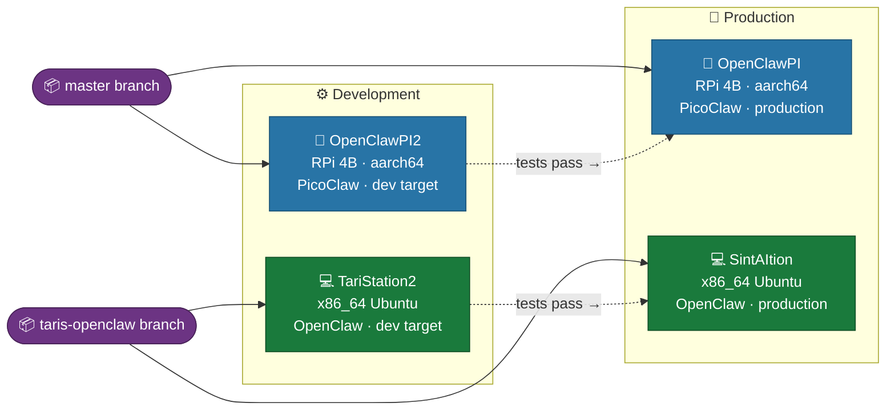
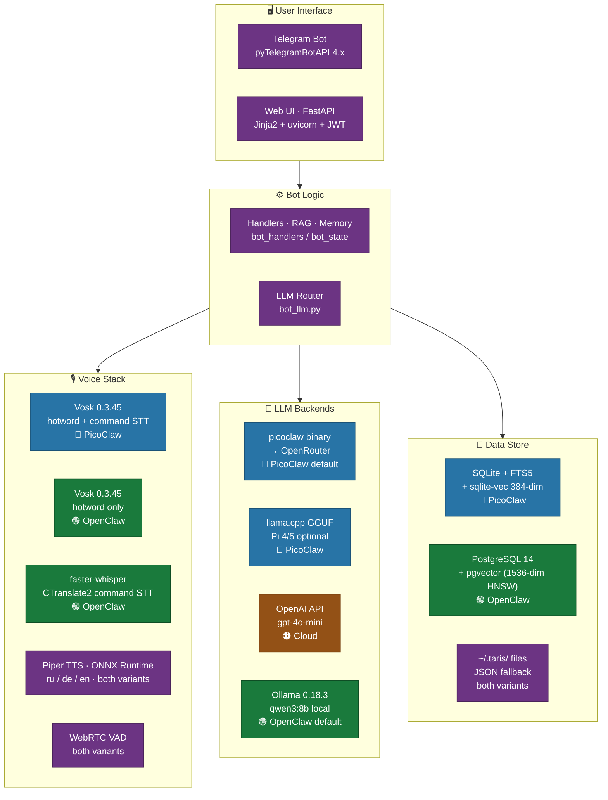
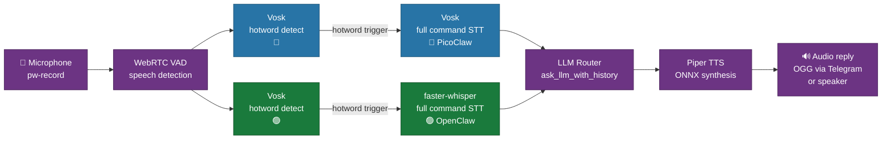

# Taris — Software Stacks

**Version:** `2026.4.68`  
→ Architecture index: [architecture.md](../architecture.md)

## When to read this file
Choosing a library, checking a dependency version, understanding which third-party services are used, or planning an upgrade.

---

## Diagrams

> Color key — applies to all diagrams on this page  
> 🔵 **PicoClaw** — Raspberry Pi / aarch64 (`master` branch)  
> 🟢 **OpenClaw** — x86_64 laptop/PC (`taris-openclaw` branch)  
> 🟣 **Both variants** — shared component  
> 🟠 **Cloud service** — external, requires internet  

### Deployment Topology

### Full Software Stack — All Variants

### Voice Pipeline — Variant Comparison

---

## Variant Comparison — Top-Level Stack

| Layer | PicoClaw (Pi) | OpenClaw (Laptop/PC) |
|---|---|---|
| **OS** | Raspberry Pi OS Bookworm 64-bit (aarch64) | Ubuntu 22.04 / Debian Bookworm (x86_64) |
| **Python** | 3.11 (system) | 3.11 (system) |
| **Bot framework** | pyTelegramBotAPI | pyTelegramBotAPI |
| **Web UI** | FastAPI + Jinja2 + uvicorn | FastAPI + Jinja2 + uvicorn |
| **STT (hotword)** | Vosk 0.3.45 (Kaldi, streaming) | Vosk 0.3.45 (Kaldi, streaming) |
| **STT (commands)** | Vosk or whisper.cpp | **faster-whisper** (CTranslate2) |
| **TTS** | Piper (ONNX Runtime, aarch64) | Piper (ONNX Runtime, x86_64) |
| **LLM (primary)** | `taris` / OpenRouter (cloud) | OpenAI API / Ollama (local) |
| **LLM (local)** | llama.cpp (Pi 4/5 only) | Ollama 0.18.3 (qwen3:8b default) |
| **Audio capture** | PipeWire / pw-record | PipeWire / pw-record |
| **Data store** | SQLite + FTS5 (default) | PostgreSQL 14+ + pgvector |
| **Process model** | systemd system services (`sudo`) | systemd user services |

---

## Python Dependencies (both variants)

| Package | Version | Purpose |
|---|---|---|
| `pyTelegramBotAPI` | 4.x | Telegram Bot API client |
| `fastapi` | 0.110+ | Web UI HTTP server |
| `uvicorn` | 0.29+ | ASGI server for FastAPI |
| `jinja2` | 3.x | Web UI HTML templating |
| `python-jose` | 3.3+ | JWT tokens for Web UI auth |
| `passlib[bcrypt]` | 1.7+ | Password hashing (Web UI) |
| `vosk` | 0.3.45 | Offline STT (Russian/German/English) |
| `webrtcvad` | 2.0.10 | Voice Activity Detection (VAD) |
| `requests` | 2.x | HTTP calls (LLM APIs, Telegram download) |
| `openai` | 1.x | OpenAI API + compatible (Ollama REST) |
| `pdfminer.six` | 20.x | PDF text extraction (fallback) |
| `PyMuPDF` (`fitz`) | 1.23+ | PDF text + image extraction (primary; optional) |
| `python-docx` | 0.8+ | DOCX document extraction |
| `psutil` | 5.x | RAM detection for RAG tier selection |

### PicoClaw-only Python dependencies

| Package | Version | Purpose |
|---|---|---|
| `sqlite3` | stdlib | SQLite FTS5 data layer |

### OpenClaw-only Python dependencies

| Package | Version | Purpose |
|---|---|---|
| `faster-whisper` | 0.10+ | CTranslate2-based Whisper STT |
| `ctranslate2` | 3.x | Inference backend for faster-whisper |
| `scipy` | 1.x | Audio resampling for faster-whisper |
| `sentence-transformers` | 2.x | `all-MiniLM-L6-v2` embeddings for pgvector |
| `psycopg2-binary` | 2.9+ | PostgreSQL driver |
| `pgvector` | 0.2+ | pgvector Python binding |
| `python-multipart` | 0.x | File upload in FastAPI |

---

## System Binaries

| Binary | Variant | Source | Purpose |
|---|---|---|---|
| `piper` | Both | [rhasspy/piper](https://github.com/rhasspy/piper) | TTS synthesis; ONNX Runtime bundled |
| `ffmpeg` | Both | apt `ffmpeg` | OGG→PCM decode, PCM→OGG encode, TTS encode |
| `pw-record` | Both | apt `pipewire` | Audio capture from mic |
| `picoclaw` | PicoClaw | [sipeed/picoclaw v0.2.0](https://github.com/sipeed/picoclaw) aarch64 deb | `taris` LLM CLI; wraps OpenRouter |
| `whisper` | PicoClaw (opt) | whisper.cpp ggml build | Alternative STT (slower, better WER) |
| `ollama` | OpenClaw | [ollama.ai](https://ollama.ai) 0.18.3 | Local LLM server; models at `~/.local/ollama-models` |
| `git` | Both | apt | Source control |

---

## LLM Models — Deployed

| Variant | Provider | Model | RAM | Notes |
|---|---|---|---|---|
| PicoClaw | `taris` / OpenRouter | `openrouter/openai/gpt-4o-mini` | cloud | Default; requires internet |
| PicoClaw | `local` (llama.cpp) | Any GGUF | ≥4 GB | Pi 4/5 only; Pi 3 too slow |
| PicoClaw | `openai` | `gpt-4o-mini` | cloud | Direct OpenAI API |
| OpenClaw | `ollama` (primary) | `qwen3:8b` | ~5 GB | **Default; offline local LLM** |
| OpenClaw | `ollama` | `qwen3.5:latest` | ~6 GB | SintAItion production (AMD ROCm GPU) |
| OpenClaw | `ollama` | `qwen2:0.5b` / `qwen3.5:0.8b` | ~1 GB | Low-RAM fallback (TariStation2) |
| OpenClaw | `openai` | `gpt-4o-mini` | cloud | Cloud fallback (`LLM_FALLBACK_PROVIDER`) |

---

## Voice Models — Deployed

| Model | Variant | Language | Size | Path |
|---|---|---|---|---|
| `vosk-model-small-ru-0.22` | Both | Russian | 48 MB | `~/.taris/vosk-model-small-ru/` |
| `vosk-model-small-de` | Both (opt) | German | 48 MB | `~/.taris/vosk-model-small-de/` |
| `vosk-model-small-en` | Both (opt) | English | 40 MB | `~/.taris/vosk-model-small-en/` |
| `ru_RU-irina-medium.onnx` | Both | Russian | 66 MB | `~/.taris/ru_RU-irina-medium.onnx` |
| `ru_RU-irina-low.onnx` | Both (opt) | Russian | 18 MB | `~/.taris/ru_RU-irina-low.onnx` |
| `de_DE-thorsten-medium.onnx` | Both (opt) | German | 63 MB | `~/.taris/de_DE-thorsten-medium.onnx` |
| `ggml-base.bin` | PicoClaw (opt) | Multi | 142 MB | `~/.taris/whisper/ggml-base.bin` |
| `faster-whisper base` | OpenClaw | Multi | 300 MB | `~/.cache/huggingface/...` |
| `faster-whisper small` | OpenClaw (SintAItion) | Multi | 500 MB | `~/.cache/huggingface/...` — recommended for SintAItion |

---

## Third-Party Services (Cloud)

| Service | Used by | Purpose | Required |
|---|---|---|---|
| `api.telegram.org` | All | Telegram Bot API | ✅ Always |
| `api.openai.com` | `openai` provider | GPT-4o-mini LLM | If `LLM_PROVIDER=openai` |
| `openrouter.ai` | `taris` / picoclaw binary | LLM routing | PicoClaw default |
| Tailscale | Deploy | Remote access to Pi targets | For remote deploy only |

---

## Setup Scripts

| Script | Variant | What it installs |
|---|---|---|
| `src/setup/setup_voice.sh` | PicoClaw | Vosk, Piper, ffmpeg, pw-record |
| `src/setup/setup_voice_openclaw.sh` | OpenClaw | Vosk, Piper, faster-whisper, ffmpeg |
| `src/setup/setup_llm_openclaw.sh` | OpenClaw | Ollama + pull default model |
| `src/setup/install_service.sh` | PicoClaw | systemd system service files |
